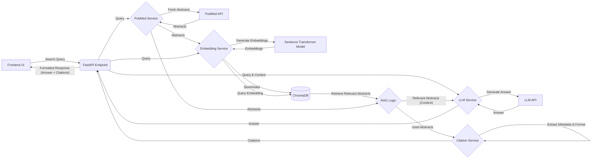

# Backend Service for PubMed RAG Answer Engine

This directory contains the Python backend service responsible for handling user queries, interacting with the PubMed API, performing Retrieval-Augmented Generation (RAG), generating answers using an LLM, and providing citations.

## Core Functionality

1.  **API Endpoint:** Exposes a FastAPI endpoint to receive search queries from the frontend.
2.  **PubMed Integration:** Fetches relevant article abstracts from PubMed using the E-utilities API based on the search query.
3.  **Semantic Search (RAG):**
    *   Generates sentence embeddings for fetched abstracts using a pre-trained model (e.g., PubMedBERT).
    *   Stores and indexes these embeddings in a ChromaDB vector database.
    *   Retrieves the most semantically relevant abstracts from ChromaDB based on the user's query embedding.
4.  **LLM Answer Generation:** Sends the user query and the retrieved abstracts (as context) to an LLM (e.g., via OpenAI API) to generate a comprehensive answer.
5.  **Citation Generation:** Extracts metadata (title, authors, year) from the abstracts used in the response and formats basic citations (e.g., APA or Vancouver style).
6.  **Response Formatting:** Packages the LLM-generated answer and the formatted citations into a JSON response for the frontend.

## Architecture Diagram



## Setup & Running

These instructions assume you are in the `backend` directory.

1.  **Set up Python Environment:**
    *   **Using `pyenv` (Recommended if installed):** Ensure `pyenv` is configured to use Python 3.10.12 (or a compatible 3.10+ version) in this directory. You might have already run `pyenv local 3.10.12`.
    *   **Create Virtual Environment:** Use Python's built-in `venv` module. This command creates a `.venv` directory containing the Python interpreter and package library.
        ```bash
        python -m venv .venv
        ```
    *   **Activate Virtual Environment:** Before installing dependencies or running the app, activate the environment:
        *   On macOS/Linux:
            ```bash
            source .venv/bin/activate
            ```
        *   On Windows:
            ```bash
            .venv\Scripts\activate
            ```
        Your terminal prompt should change to indicate the `.venv` environment is active.

2.  **Install Dependencies:**
    *   With the virtual environment *activated*, install the required packages:
        ```bash
        pip install -r requirements.txt
        ```
    *   *(Optional)* Upgrade pip if prompted:
        ```bash
        pip install --upgrade pip
        ```

3.  **Configure Environment Variables:**
    *   Ensure the `.env` file exists in the `backend` directory (create if needed: `touch .env`).
    *   Add your Google API key (for Gemini) and optional PubMed API key to the `.env` file:
        ```dotenv
        GOOGLE_API_KEY="your_google_api_key_here"
        PUBMED_API_KEY="your_pubmed_api_key_here" # Optional, but recommended for higher rate limits
        ```
    *   Replace keys with your actual values. The services use `python-dotenv` to load these keys automatically.

4.  **Run Development Server:**
    *   **Navigate to the `backend` directory** if you aren't already there.
    *   Make sure the virtual environment is still *activated* (`source .venv/bin/activate` or `.venv\Scripts\activate`).
    *   Start the FastAPI server using Uvicorn from within the `backend` directory:
        ```bash
        uvicorn main:app --reload --port 8000 --host 0.0.0.0
        ```
    *   The command `uvicorn main:app` tells Uvicorn to look for the `app` object within the `main.py` file *in the current directory*.
    *   The `--host 0.0.0.0` part makes the server accessible from other devices on your local network (e.g., using your machine's IP address like `http://192.168.x.x:8000`) as well as `http://localhost:8000` or `http://127.0.0.1:8000` from the same machine.
    *   The `--reload` flag automatically restarts the server when code changes are detected.
    *   The API will be available at `http://<your-machine-ip>:8000` and `http://localhost:8000`.

5.  **Deactivate Virtual Environment:**
    *   When you are finished working, you can deactivate the environment:
        ```bash
        deactivate
        ``` 